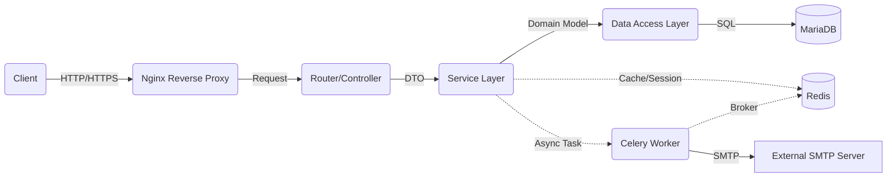

# 🏛️ FastAPI Enterprise Architecture


> **Spring Boot의 계층형 아키텍처를 이식한 고성능 FastAPI 보일러플레이트**  
> "확장성과 유지보수성을 극대화한 엔터프라이즈급 비동기 API 서버 구조 설계"

---

## 🏗 System Architecture

이 프로젝트는 유지보수성과 확장성을 고려하여 **관심사의 분리(Separation of Concerns)** 원칙을 철저히 준수합니다.



### 📂 Directory Structure
Spring Boot의 패키지 구조와 1:1 매핑되도록 설계되었습니다.

```text
app/
├── core/               # [Global] 설정 및 공통 유틸리티
│   ├── config.py       # 환경변수 관리 (Pydantic Settings)
│   ├── database.py     # DB Connection Pool (SQLAlchemy Engine)
│   ├── security.py     # JWT 생성 및 비밀번호 Hashing (Bcrypt)
│   ├── logger.py       # Loguru 통합 로깅 시스템
│   ├── redis.py        # Redis 연결 관리
│   ├── celery_app.py   # Celery 워커 설정
│   └── dependencies.py # [AOP/Filter] 의존성 주입 (Token 검증 등)
│
├── models/             # [Entity] DB 테이블 스키마 정의
├── schemas/            # [DTO] 데이터 검증 및 API 입출력 모델
├── repository/         # [Repository] DB 접근 로직 (CRUD)
├── services/           # [Service] 비즈니스 로직 및 트랜잭션 단위
├── routers/            # [Controller] URL 라우팅 및 요청 처리
├── tasks/              # [Async] Celery 비동기 작업 정의 (이메일 등)
└── main.py             # [Application] 앱 진입점
```

---

## ✨ Key Features

### 🔐 1. Authentication & Security
- **RBAC (Role-Based Access Control)**: Admin, User, Guest로 권한을 세분화하여 API 접근 제어 시스템 구축.
- **Social Login Only**: 사용자 편의성과 보안을 위해 일반 아이디/비밀번호 방식을 제거하고 소셜 로그인(OAuth2)으로만 인증하도록 설계.
- **Google & Kakao OAuth2**: Google 및 Kakao 소셜 로그인 연동 및 신규 유저 자동 가입 로직 구현.
- **JWT (JSON Web Token)**: 소셜 인증 완료 후 서버 자체 JWT를 발급하여 통합 세션 관리.
- **HTTPBearer**: Swagger UI에서 소셜 토큰을 직접 입력하여 테스트할 수 있는 환경 구축.
- `Depends(RoleChecker)`를 통한 선언적 권한 검증 (Guard) 적용.

### 🛠 2. Robust CRUD Operations
- **Clean Code**: Router → Service → Repository 흐름의 명확한 역할 분리.
- **Data Validation**: Pydantic V2를 활용한 강력한 요청 데이터 검증.
- **Error Handling**: 명시적인 HTTP Exception 처리.
- **Cascade Delete**: SQLAlchemy `cascade` 설정을 통한 연관 데이터(댓글) 자동 삭제 관리.
- **Pagination**: Spring의 `Page` 객체를 벤치마킹한 공통 페이징 응답 구조 구축.

### ⚙️ 3. Configuration Management
- **Environment Variables**: `.env` 파일을 통한 민감 정보(DB, Secret Key) 분리.
- **Pydantic Settings**: 환경변수 타입 강제 및 유효성 검사.

### 📝 4. Advanced Logging
- **Loguru** 라이브러리 도입.
- Uvicorn의 시스템 로그를 가로채어(Intercept) 통일된 컬러 포맷으로 출력.

---

## 🚀 Getting Started

### Prerequisites
- Python 3.10+
- MariaDB (or MySQL)
- Docker & Docker Compose

### Installation & Run

1. **Clone the repository**
   ```bash
   git clone https://github.com/Yeonghoon-mo/FastAPI-Enterprise-Architecture.git
   cd FastAPI-Enterprise-Architecture
   ```

2. **Environment Setup (.env)**
   프로젝트 루트에 `.env` 파일을 생성하고 DB 및 소셜 로그인(Google, Kakao) 정보를 입력하세요.

3. **Run with Docker**
   ```bash
   docker-compose up -d --build
   ```

### DB Migration (Alembic)

- **마이그레이션 파일 생성**: `docker exec fastapi_enterprise_api alembic revision --autogenerate -m "메시지"`
- **DB 반영**: `docker exec fastapi_enterprise_api alembic upgrade head`

---

## 🗺️ Roadmap & Future Plans

### Phase 1~4: Foundation & DevOps (✅ Completed)
- [x] Layered Architecture & MariaDB/SQLAlchemy Integration
- [x] JWT Authentication & Loguru System
- [x] Board/Comment Domain Expansion & Pagination
- [x] Async I/O, Redis Caching, Celery Background Tasks
- [x] Dockerization, Pytest Integration, CI/CD Pipeline (GitHub Actions)
- [x] Metrics: Prometheus & Grafana Monitoring

### Phase 5: Security & User Experience (✅ Completed)
- [x] **OAuth2**: Google & Kakao 소셜 로그인 연동 및 통합 JWT 발급 완료
- [x] **RBAC**: Role-Based Access Control (Admin, User, Guest) 권한 체계 구축 완료
- [x] **Reverse Proxy**: Nginx를 활용한 리버스 프록시 구축 및 로컬 인프라 통합 완료

### Phase 6: Performance & Stability (✅ Completed)
- [x] **Rate Limiting**: Redis를 활용한 API 요청 제한 (Throttling)
- [x] **API Versioning**: `/v1`, `/v2` 등 유연한 API 버전 관리 전략 도입
- [x] **API Documentation**: Swagger UI 상세화 및 ReDoc 도입

---

## 🛠 Technical Deep Dive (Portfolio)

### 1. RBAC (Role-Based Access Control) Implementation
엔터프라이즈 환경에서의 체계적인 권한 관리를 위해 RBAC 시스템을 구축했습니다.
- **UserRole Enum**: `Enum` 클래스를 사용하여 역할을 정의하고 DB 컬럼과 매핑하여 무결성을 확보했습니다.
- **Declarative Guard**: FastAPI의 DI 시스템을 활용하여 `RoleChecker` 클래스를 구현, 컨트롤러에서 선언적으로 권한을 제한합니다.

### 2. Social Login Strategy (OAuth2)
- **Multi-Provider**: `GoogleAuthService`, `KakaoAuthService` 분리 구현으로 확장성을 확보했습니다.
- **Unified JWT**: 어떤 소셜 제공자든 최종적으로는 서버의 자체 JWT를 발급하여 프론트엔드 관리를 일원화했습니다.

### 3. Repository Polymorphism & Safety
- **Type Flexibility**: `create_user` 함수가 DTO와 Entity를 모두 처리할 수 있도록 다형성을 부여했습니다.
- **Conditional Hashing**: 소셜 유저와 같이 비밀번호가 없는 경우를 분기 처리하여 런타임 에러를 방지했습니다.

### 4. Local Infrastructure with Nginx (Reverse Proxy)
- **Unified API Gateway**: Nginx를 리버스 프록시로 세워 모든 요청을 80번 포트에서 통합 관리합니다.
- **Port Management**: Grafana(4000) 등 각 서비스의 포트를 조정하여 접근성을 개선했습니다.

---

## 🛠 Troubleshooting (Issue Solving)

개발 과정에서 발생한 기술적 문제들과 이를 해결한 과정을 기록합니다.

### 1. Bcrypt & Passlib Compatibility Issue
- **Issue**: `bcrypt` 최신 버전에서 `passlib` 내부 속성 변경으로 인한 에러.
- **Solution**: `bcrypt` 버전을 `4.0.1`로 하향 조정하여 호환성 확보.

### 2. Static Files Directory Error
- **Issue**: `RuntimeError: Directory 'static' does not exist` 발생.
- **Cause**: 실행 환경(CWD)에 따라 상대 경로가 달라져서 발생하는 문제.
- **Solution**: `config.py`에서 `BASE_DIR`을 기반으로 한 절대 경로를 생성하여 실행 환경 독립성 확보.

### 3. Celery Unregistered Task Error
- **Issue**: `Received unregistered task of type 'app.tasks.email_task.send_welcome_email'` 발생.
- **Cause**: Celery 워커 실행 시 비동기 태스크가 정의된 모듈을 로드하지 못함.
- **Solution**: `Celery` 인스턴스 생성 시 `include` 옵션으로 태스크 모듈을 명시적으로 등록하여 해결.

### 4. Pydantic Response Validation Error
- **Issue**: API 응답 시 `ResponseValidationError` 발생.
- **Cause**: 응답 DTO 필드와 실제 DB 모델 컬럼명 불일치.
- **Solution**: DB PK 전략에 맞춰 DTO 필드를 조정하고 `from_attributes=True` 설정을 통해 정합성 확보.

### 5. GitHub Actions CI Failure (Pytest not found)
- **Issue**: CI 환경에서 `pytest` 명령어를 찾지 못해 빌드 실패.
- **Solution**: `python -m pytest` 형식을 사용하여 현재 파이썬 환경의 모듈로 실행하도록 워크플로우 수정.

### 6. Docker Tag Case Sensitivity Error (CD)
- **Issue**: `invalid tag "...": repository name must be lowercase` 발생.
- **Cause**: GitHub 계정명에 대문자가 포함되어 있으나 도커 이미지 태그는 소문자여야 함.
- **Solution**: 워크플로우에서 계정명을 소문자로 변환하는 전처리 단계(`${OWNER,,}`) 추가.

### 7. GitHub Actions CI Failure (Static Directory Missing)
- **Issue**: Git에서 빈 디렉토리를 추적하지 않아 CI 환경에 `static` 폴더가 없음.
- **Solution**: `app/main.py` 코드 내에서 마운트 전 디렉토리 존재 여부를 체크하고 자동 생성하는 로직 추가.

### 8. Docker CD Success but Container Not Updated
- **Issue**: 이미지 빌드 및 Push만 구현되어 서버 배포가 이루어지지 않음.
- **Solution**: `cd.yml` 내 배포 섹션을 활성화하고 SSH 연동을 통해 자동 배포 프로세스 완성.

### 9. OAuth2 Callback 404 Not Found
- **Issue**: Google 로그인 성공 후 콜백 URI 접속 시 404 에러 발생.
- **Solution**: `main.py`에서 `prefix="/api"`를 일괄 적용하여 모든 API 주소 체계를 통일했습니다.

### 10. Swagger UI Token Input Convenience
- **Solution**: `HTTPBearer` 스키마로 전환하여 Swagger에서 토큰만 즉시 입력 가능하도록 개선했습니다.

### 11. TypeError in Social User Registration
- **Issue**: 소셜 유저의 `None` 비밀번호 해싱 시도 중 발생한 에러.
- **Solution**: 레포지토리에 타입 체크 및 조건부 해싱을 도입하여 해결했습니다.

---

**Mo Yeonghoon**
- Backend Developer (Java/Kotlin, Python)
- Github: [@Yeonghoon-mo](https://github.com/Yeonghoon-mo)
